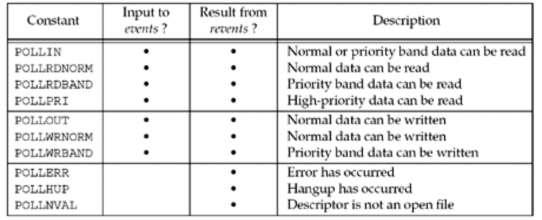

# 知识点

# Linux多路复用介绍

## 1.1  I/O 模型

> UNIX网络编程 卷一：套接字联网 -122

### 1.1.1阻塞式 I/O 模型

```
recvfrom视为系统调用，无论如何实现，一般都会从应用进程空间切换到内核空间
```


### 1.1.2非阻塞式 I/O 模型

```
 检查 - 检查 - 检查 --- 阻塞 ---------> 完成
 一个应用进程对非阻塞描述符循环调用recfrom时，我们视为轮询，非常耗费资源
```


### 1.1.3 I/O 复用模型

```
 检查 -------- 就绪发起 ------ 阻塞 ---------> 完成
 经典模型：slect & poll
 简介：阻塞在slect或者poll方法上，而不是阻塞在真正的 I/O 系统调用上
 详细：我们阻塞slect调用，等待数据包套接字变为可读，当select返回套接字可读这一条件
      我们调用recvfrom把所有可读数据复制到应用进程缓冲区
```


### 1.1.3 信号驱动式 I/O 模型

```
-------- 通知发起 ---- 阻塞 ---------> 完成
简介：我们可以用信号，在内核描述符就绪时，发送SIGIO信号通知我们
难点：sigaction
优势：等待数据报到达期间进程不被阻塞，主循环可以继续进行，只要等待信号处理函数的通知
```


### 1.1.4 异步 I/O 模型

```
发起 ---------------------> 通知
个人理解：异步，即为主进程和I/O之间的异步。信号驱动式I/O是内核通知我们何时可以启动一个
        I/O操作，而异步模型是内核通知我们I/O操作何时完成。即I/O操作从主进程中分离开
```


## 1.2 select

> UNIX网络编程 卷一：套接字联网 -127

```
简介：该函数指示内核等待多个事件中的任何一个发生，或timeout
数据结构：bitmap
唤醒条件：
1. 描述符的读或写操作
2. 描述符的异常待处理
3. timeout
返回值：
定时器到达：0
出错：-1
正常：返回所有描述符集中已经就绪的总位数
```

```c
#include <sys/select.h>
#include <sys/time.h>

int select(int maxfdp1, fd_set *readset, fd_set *writeset, 
    fd_set *exceptset, const struct timeval *timeout);
```

### 1.2.1 参数const struct timeval *timeout

```c
struct timeval  {
  long   tv_sec;          /* seconds */
  long   tv_usec;         /* microseconds */
};
```

这个参数导致的三种情况：

1. 永远等待下去，直到描述符改变    —— 设置为NULL

2. 等待一段固定事件，超时返回   

3. 根本不等待，    —— 设置为 0 

### 1.2.2 参数 fd_set *

```
简介：描述符集，即为bitmap，可以设置为空
```

```c
void FD_ZERO(fd_set *fdset);  /* clear all bits in fdset */

void FD_SET(int fd, fd_set *fdset);  /* turn on the bit for fd in fdset */

void FD_CLR(int fd, fd_set *fdset);  /* turn off the bit for fd in fdset */

int FD_ISSET(int fd, fd_set *fdset);  /* is the bit for fd on in fdset ? */
```

**!ATTENTION***

    描述符集的初始化相当重要！初始化都相当重要，使用变量一定要初始化！！

### 1.2.3 参数 maxfdpl

```
简介：最大描述符个数，值为最大描述符 + 1
例如：打开描述符1，4，5 那么maxfdpl = 6
```

## 1.3 poll

> UNIX 网络编程 卷一：套接字联网 -144

```
简介：poll提供的功能和slect相似，不过在处理流设备时，它能够提供额外的信息
依旧需要拷贝操作
```

```c
#include <poll.h>

int poll (struct pollfd *fdarray, unsigned long nfds, int timeout);

Returns: count of ready descriptors, 0 on timeout, –1 on error
```

### 1.3.1 参数stuct polled *fdarry

```c
struct pollfd {
  int     fd;       /* descriptor to check */
  short   events;   /* events of interest on fd */
  short   revents;  /* events that occurred on fd */
};
```

fd取值实例：



*attention!!!l*  第三部分的值不能在events中设置，但是相应条件存在时就在revents返回

## 1.4 poll和select的缺点

> bilibili epoll

1. 最大并发数限制：
   
   ```
   由于一个进程所打开的fd，是有限制的，由FD_SETSIZE设置，默认值是1024/2048
   poll克制了这个缺点
   ```

2. 效率问题
   
   ```
   每次进行select调用都会线性扫描全部的fd集合。效率会呈现线性下降
   ```

3. 内核/用户空间的拷贝问题
   
   ```
   select在将fd消息传递给用户空间时采用了内存拷贝的方式
   ```

4. 时间复杂度
   
   ```
   select O(n)
   poll   O(n)
   epoll  O(1)
   ```

## 1.5 epoll

```

```

### 1.5.1 提出

通知机制

异步 I/O

```
·它所支持的文件描述符上限是整个系统最大可以打开的文件数目
    ·例如：在1GB内存上，这个限制大概为10w左右
·每个fd上注册callback函数，只有活跃的socket调用callback函数
·通过内核与用户空间mmap同一块内存来实现
```

### 1.5.2 数据结构

```
红黑树
事件链表
```

### 1.5.3 epoll_create()

```
简介：创建epfd，即一个红黑树,epoll的句柄
注意：使用完epoll后，必须调用close()
```

### 1.5.4 epoll_ctl(int epfd, int op, int fd, struct epoll_event *event);

1. epfd
   
   ```
   epoll_create 函数的返回句柄
   ```

2. op
   
   ```
   表示动作类型。有三个宏表示：
   ·EPOLL_CTL_ADD:注册新的fd到epfd中
   ·EPOLL_CTL_MOD：修改
   ·EPOLL_CTL_DEL：删除
   ```

3. fd
   
   ```
   需要监听的fd
   ```

4. *event
   
   ```
   告诉内核需要监听什么事件
   ·EPOLLIN：表示对应的文件描述符可读；
   ·EPOLLOUT：可写；
   ·EPOLLPRI：表示对应的文件描述符有紧急数据可读；（带外数据）
   ·EPOLLERR
   ·EPOLLHUB
   ·EPOLLET：将EPOLL设为边缘触发（Edge），一次读取处理所有数据，否则丢失
   ·
   ```

### 1.5.5 epoll_wait(int epfd, struct epoll_event *events, int maxevents, int timeout)

```
功能：等待事件的产生，类似与select()调用
```

参数：

1. epfd
   
   ```
   创建的epoll文件描述符
   ```

2. events
   
   ```
   用来从内核得到事件的集合
   ```

3. maxevents
   
   ```
   表示每次处理的最大事件数
   ```

4. timeout
   
   ```
   0 立即返回
   -1 阻塞
   ```

### 1.5.6 epoll_event

```c
typedef union epoll_data{
    void    *ptr;    //用来指向函数
    int       fd;
    uint32_t u32;
    uint64_t u64;
}epoll_data_t;
```

```c
struct epoll_event{
    uint32_t   events;    // Epoll events
    epoll_data_t data;    // User data variable
};
```

# 文件信息结构体STAT

```cpp
struct stat  
{   
    dev_t       st_dev;     /* ID of device containing file -文件所在设备的ID*/  
    ino_t       st_ino;     /* inode number -inode节点号*/    
    mode_t      st_mode;    /* protection -保护模式?*/    
    nlink_t     st_nlink;   /* number of hard links -链向此文件的连接数(硬连接)*/    
    uid_t       st_uid;     /* user ID of owner -user id*/    
    gid_t       st_gid;     /* group ID of owner - group id*/    
    dev_t       st_rdev;    /* device ID (if special file) -设备号，针对设备文件*/    
    off_t       st_size;    /* total size, in bytes -文件大小，字节为单位*/    
    blksize_t   st_blksize; /* blocksize for filesystem I/O -系统块的大小*/    
    blkcnt_t    st_blocks;  /* number of blocks allocated -文件所占块数*/    
    time_t      st_atime;   /* time of last access -最近存取时间*/    
    time_t      st_mtime;   /* time of last modification -最近修改时间*/    
    time_t      st_ctime;   /* time of last status change - */    
};  
```

***_stat函数使用方法***

```cpp
//! 需要包含de头文件  
#include <sys/types.h>    
#include <sys/stat.h>   
int stat(
　　const char *filename    //文件或者文件夹的路径
　　, struct stat *buf      //获取的信息保存在内存中
); //! prototype,原型
```

```cpp
#include <iostream>  
#include <ctime>   
#include <sys/types.h>    
#include <sys/stat.h>     
using namespace std;     
int  main ()  
{  
    struct stat buf;    
    int result;    
    result = stat ("./Makefile", &buf);    
    if (result != 0)  
      {  
          perror ("Failed ^_^");  
      }  
    else  
      {    
          //! 文件的大小，字节为单位    
          cout << "size of the file in bytes: " << buf.st_size << endl;    
          //! 文件创建的时间    
          cout << "time of creation of the file: " << ctime (&buf.st_ctime) << endl;   
          //! 最近一次修改的时间    
          cout << "time of last modification of the file: " << ctime (&buf.st_mtime) << endl;    
          //! 最近一次访问的时间    
          cout << "time of last access of the file: " << ctime (&buf.st_atime)<< endl;  
      }    
    return 0;    
}
```
