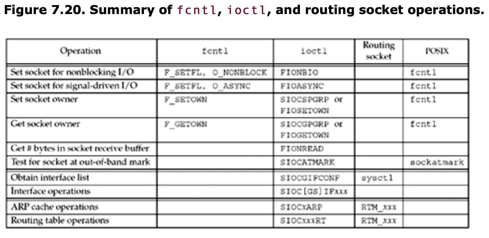
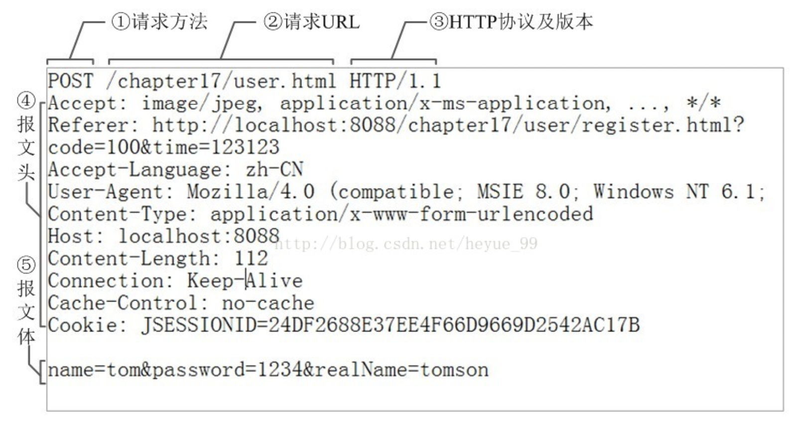
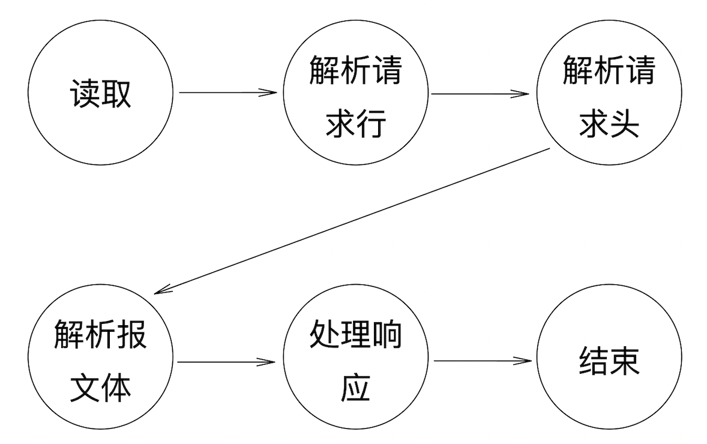
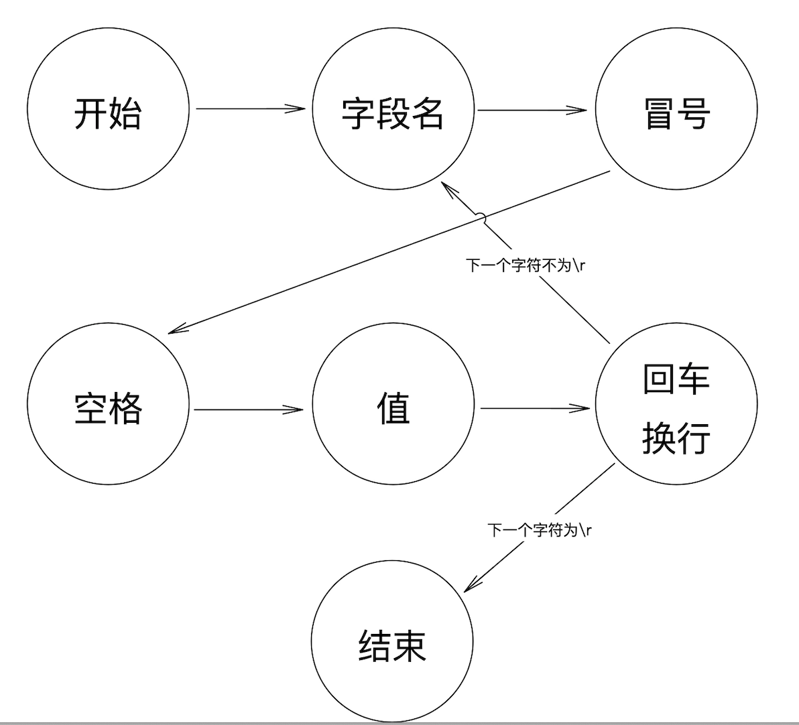

# WebServer Documents

```
操作系统简介：Linux version 3.10.0-514.26.2.el7.x86_64 (builder@kbuilder.dev.centos.org) 
           (gcc version 4.8.5 20150623 (Red Hat 4.8.5-11) (GCC) ) 
           #1 SMP Tue Jul 4 15:04:05 UTC 2017
c++标准：   c++11及以上
```

## 1. Header File and Source File

### 1.1 EPOLL_H_

**instruction：**

```textile
封装了实现epoll的一系列方法和参数
```

**"epoll.h" include：**

```cpp
#include "requestData.h"
```

#### 1.1.1 const parm and global variable

1. **MAXEVENTS**
   
   ```css
   type: const int
   value: 1024
   instruction: 结构体 epoll_event 数组 events 的大小
   reference: -14epoll.cpp    events = new epoll_event[MAXEVENTS];
   ```

2. **LISTENNUM**
   
   ```css
   type: const int
   value: 1024
   instruction: 用于epoll_create(int size_t)
   reference: -10epoll.cpp    epoll_fd = epoll_create(LISTENNUM + 1);
   ```

#### 1.1.2 epoll_init()

- **instruction**
  
  ```textile
  epoll初始化，包含了epoll_create()返回一个红黑树
  ```

- **@return**
  
  ```cpp
  epfd 创建的epoll文件描述符    
  ```

- **Error code**
  
  ```css
  -1 创建失败 
  ```

#### 1.1.3 epoll_add()

- **instruction**
  
  ```textile
  添加文件描述符fd和事件到epoll描述符epfd中，调用epoll_ctl(epfd, EPOLL_CTL_ADD, fd, &event
  ```

- **@return**
  
  ```cpp
  0 succeed    
  ```

- **parameter**
  
  ```cpp
  int         epfd
  int         fd
  void*       request   /* 事件调用 */
  __uint32_t  events    /* epoll描述符集合 */
  ```

- **Error code**
  
  ```css
  -1 epoll_add error 
  ```

#### 1.1.4 epoll_mod()

- **instruction**
  
  ```textile
  修改 epfd 中 fd 的 event，调用epoll_ctl(epoll_fd, EPOLL_CTL_MOD, fd, &event)
  ```

- **@return**
  
  ```cpp
  0 succeed  
  ```

- **parameter**
  
  ```cpp
  int         epfd
  int         fd
  void*       request   /* 事件调用，一般是结构体 */
  __uint32_t  events    /* epoll的各种参数 */
  ```

- **Error code**
  
  ```css
  -1 epoll_mod error 
  ```

#### 1.1.5 epoll_del()

- **instruction**
  
  ```textile
  删除 epfd 中的 fd，调用epoll_ctl(epoll_fd, EPOLL_CTL_DEL, fd, &event)
  ```

- **@return**
  
  ```cpp
  0 succeed  
  ```

- **parameter**
  
  ```cpp
  int         epfd
  int         fd
  void*       request   /* 事件调用 */
  __uint32_t  events    /* epoll描述符集合 */
  ```

- **Error code**
  
  ```
  -1 epoll_del error
  ```

#### 1.1.6 epoll_wait()

- **instruction**
  
  ```textile
  等待事件产生，返回活跃的事件数
  ```

- **@return**
  
  ```cpp
  0 succeed  
  ```

- **parameter**
  
  ```cpp
  int                 epfd
  struct epoll_event* events     /* 返回发生的事件集合 */
  int                 max_events /* 最大事件数 */
  int                 timeout    /* 参考 知识点.md 1.2.1 */
  ```

- **Error code**
  
  ```
  -1 epoll_del error
  ```

### 1.2 EPOLL_CPP_

**instruction:**

```textile

```

**"epoll.cpp" include：**

```cpp
#include "epoll.h"
#include <sys/epoll.h>
#include <errno.h>
#include "threadpool.h"
```

#### 1.2.1 const parm and global variable

1. **events**
   
   ```css
   type: struct epoll_event*
   instruction: 用来从内核得到事件的集合
   reference: -64epoll.cpp    ret_count = epoll_wait(epoll_fd, events, max_events, timeout);
   ```

### 1.3 UTHI_H_

**instruction：**

```textile
使用socket的一些基本方法和选项
```

**"uthl.h" include：**

```cpp
#include <cstdlib>
```

#### 1.3.1 readn()

- **instruction**
  
  ```textile
  在描述符fd中读取n个数据到buff
  ```

- **@return**
  
  ```cpp
  readSum 读到的数据长度  
  ```

- **parameter**
  
  ```cpp
  int      fd
  void*    buff
  size_t   n        
  ```

- **Error code**
  
  ```
  -1 未知错误，可能是管道破裂等等
  ```

- **Tips**
  
  ```textile
  error: EAGAIN  Resource temporarily unavailable
  这个错误在非阻塞操作中比较常见，资源暂时没到么或到了一部分呗
  
  error: EINTR  Interrupted system call
  这个问题百度几乎没有答案，垃圾百度，垃圾百度
  ALO Search中给的答案，大致是因为在读或写的过程中，发生中断，所以返回一个错误码EINTR
  ```

#### 1.3.2 writen()

- **instruction**
  
  ```textile
  写操作呗，从buff中写n个到描述符fd中
  ```

- **@return**
  
  ```cpp
  0 succeed  
  ```

- **parameter**
  
  ```cpp
  int      fd
  void*    buff
  size_t   n        
  ```

- **Error code**
  
  ```textile
  -1 unknown error
  ```

#### 1.3.3 hand_for_sigpipe()

- **instruction**
  
  > UNIX 网络编程 卷一：套接字联网 -113
  
  ```textile
  函数用来捕获SIGPIPE信号，并让该信号失效
  tips：当进程收到RST信号时，内核发送该信号，SIGPIPE信号的默认行为是终止进程
  解决方法：调用sigaction
  ```

- **@return**
  
  ```cpp
  void
  ```

#### 1.3.4 setSocketNonBlocking()

- **instruction**
  
  ```textile
  将socket设置为非阻塞
  方法：利用fcntl可执行各种描述符控制操作
  ```

- **@return**
  
  ```cpp
  0 succeed  
  ```

- **parameter**
  
  ```cpp
  int                 fd
  ```

- **Error code**
  
  ```
  -1 fcntl错误
  ```



### 1.4 UTHI_CPP_

**"uthl.cpp" include：**

```cpp
#include "util.h"
#include <unistd.h>
#include <fcntl.h>
#include <signal.h>
#include <errno.h>
#include <string.h>
```

#### 1.4.1 const parm and global variable

```

```

### 1.5 THREADPOOL_H_

**instruction：**

```textile
创建线程池
```

**"threadpool.h" include：**

```cpp
#include "requestData.h"
#include <pthread.h>
```

#### 1.5.1 const parm and global variable

***错误码：***

- **THREADPOOL_INVALID**
  
  ```css
  -1 函数中参数无效
  ```

- **THREADPOOL_LOCK_FAILURE**
  
  ```css
  -2 加锁或解锁出错
  ```

- **THREADPOOL_QUEUE_FULL**
  
  ```css
  -3 任务队列已满
  ```

- **THREADPOOL_SHUTDOWN**
  
  ```css
  -4 线程池已关闭
  ```

- **THREADPOOL_THREAD_FAILURE**
  
  ```css
  -5 join() error
  ```

***全局变量：***

- **THREADPOOL_GRACEFUL**
  
  ```css
  type: const int
  value: 1
  instruction: 是否是优雅关闭线程  ---- 优雅可还行
  ```

- **MAX_THREADS**
  
  ```css
  type: const int
  value: 1024
  instruction: 线程池最大的线程数量
  ```

- **MAX_QUEUE**
  
  ```css
  type: const int
  value: 65535
  instruction: 任务队列最大值
  ```

#### 1.5.2 struct threadpool_task_t

- **instruction**
  
  ```textile
  线程池相关的任务结构体，定义了任务结构
  ```

- **parameter**
  
  ```cpp
  void     (*function)(void*)    /* 函数指针 */
  void     *argument             /* 函数参数 */
  ```

#### 1.5.3 struct threadpool_t

- **instruction**
  
  ```textile
  线程池结构体，定义了线程池的实现
  ```

- **parameter**
  
  ```cpp
  pthread_mutex_t     lock;        /* 线程互斥锁 tips：访问多个共享内存一定要顺序一致 */
  pthread_cond_t      notify;      /* 条件变量，这里用于生产者-消费者情形 */
  pthread_t           *threads;    /*  */
  threadpool_task_t   *queue;      /* 任务队列 */
  int thread_count;                /* 创建并运行的线程数目 */  
  int queue_size;                  /* 队列大小 */
  int head;                        /* 队列头 */
  int tail;                        /* 队列尾 */
  int count;                       /* 等待的任务数量 */
  int shutdown;                    /* 是否关闭 */
  int started;                     /* 开启的线程数目 */
  ```

#### 1.5.4 *threadpool_create()

- **instruction**
  
  ```textile
  初始化线程池，线程创建并运行函数threadpoop_thread(),一旦出错，一定要把先前
  分配好的内存free掉
  ```

- **parameter**
  
  ```cpp
  int thread_count；    /* 线程数目设定 */
  int queue_size；
  int flags；           /* 由高人设定的，当前版本没用到 */
  ```

- **@return**
  
  ```cpp
  *threadpool_t pool
  ```

- **Error code**
  
  ```
  NULL 创建失败
  ```

#### 1.5.5 threadpool_thread()

- **instruction**
  
  ```textile
  线程运行函数，一定要注意锁的使用，进入公共内存需要锁，生产者-消费者问题也要注意
  ```

- **parameter**
  
  ```cpp
  void *thread_pool
  ```

- **@return**
  
  ```cpp
  static void 静态void类型
  ```

- **Error code**
  
  ```
  
  ```

#### 1.5.4 threadpool_add()

- **instruction**
  
  ```textile
  添加任务到线程池中，唤醒一个线程去执行该任务
  ```

- **parameter**
  
  ```cpp
  threadpool_t*  pool； /* 线程池结构体指针 */    
  void (*function)(void *)
  void *argument
  int flags；           /* 由高人设定的，当前版本没用到 */
  ```

- **@return**
  
  ```cpp
  0 succeed
  ```

- **Error code**
  
  ```
  -1 线程池或函数指针未定义
  -2 锁错误
  -3 任务队列已满
  -4 线程池已关闭
  ```

#### 1.5.5 threadpool_destory()

- **instruction**
  
  ```textile
  如果是优雅关闭，先完成任务队列的所有任务，再关闭线程
  如果是强制关闭，直接线程退出，不关心任务队列是否有任务
  最后，关闭线程池
  ```

- **parameter**
  
  ```cpp
  threadpool_t*  pool； /* 线程池结构体指针 */    
  void (*function)(void *)
  void *argument
  int flags；           /* 1为优雅关闭，0为强制关闭 */
  ```

- **@return**
  
  ```cpp
  0 succeed
  ```

- **Error code**
  
  ```
  -1 线程池未定义
  -2 锁错误
  -4 线程池已关闭
  -5 join() error
  ```

#### 1.5.5 threadpool_free()

- **instruction**
  
  ```textile
  如果是优雅关闭，先完成任务队列的所有任务，再关闭线程
  如果是强制关闭，直接线程退出，不关心任务队列是否有任务
  最后，关闭线程池
  ```

- **parameter**
  
  ```cpp
  threadpool_t*  pool； /* 线程池结构体指针 */    
  void (*function)(void *)
  void *argument
  int flags；           /* 1为优雅关闭，0为强制关闭 */
  ```

- **@return**
  
  ```cpp
  0 succeed
  ```

- **Error code**
  
  ```
  -1 线程池未定义
  -2 锁错误
  -4 线程池已关闭
  -5 join() error
  ```

### 1.6 REQUESTDATA_H_

**instruction：**

```textile
基于有限自动机，实现HTTP协议在应用层上的解析～
```

**"threadpool.h" include：**

```cpp
#include <string>
#include <unordered_map>  /* 据说unordered_map比ordered_map快 */
```

#### 1.5.1 const parm and global variable

***错误码：***

- **PARSE_URI_AGAIN**
  
  ```css
  -1 在读过程中遇到中断导致的
  ```

- **PARSE_URI_ERROR**
  
  ```css
  -2 error，包括n中错误，如broken pipe
  ```

- **PARSE_HEADER_AGAIN**
  
  ```css
  -1 与上相同
  ```

- **PARSE_HEADER_ERROR**
  
  ```css
  -2 与上相同
  ```

***全局变量：***

- **AGAIN_MAX_TIMES**
  
  ```css
  type: const int
  value: 200
  instruction: 设置的重传超时时间限制
  ```

- **MAX_BUFF**
  
  ```css
  type: const int
  value: 4096
  instruction: 缓冲区大小
  ```

- **KEEP_ALIVE_MAX_TIME**
  
  ```css
  type: const int
  value: 500
  instruction: 设置Keep-alive的timeout
  ```

***解析状态：***

- **STATE_PARSE_URI**
  
  ```css
  正在解析请求行
  ```

- **STATE_PARSE_HEADERS**
  
  ```css
  正在解析请求头
  ```

- **STATE_RECV_BODY**
  
  ```css
  正在解析请求数据
  ```

- **STATE_ANALYSIS**
  
  ```css
  开始分析并回应消息
  ```

- **STATE_FINISH**
  
  ```css
  如果keep-alive，那么reset
  不是的话，结束
  ```

#### 1.5.2 class MimeType

- **instruction**
  
  ```textile
  定义了http请求Accept字段中的类型映射。
  类中均为静态成员，多线程访问该类实例时注意加锁
  构造函数设置为private，禁止构造
  ```

- **parameter**
  
  ```cpp
  private：
  static pthread_mutex_t lock;
  static std::unordered_map<std::string, std::string> mime;
  /* 定义了映射关系 */
  ```

- **function**
  
  ```cpp
  static std::string getMime(const std::string &suffix);
  /* 输入Accept字段中的类型，得到linux文件扩展名 */
  ```

#### 1.5.3 struct requestData

- **instruction**
  
  ```textile
  定义了接收http请求的一系列方法，和使用到的各种字段参数等等
  ```

- **parameter**
  
  ```cpp
  private：
  int             againTimes;  /* the times of try to read httpRequest again  */
  std::string     path;        /* URL */
  int             fd;          /* socket的文件描述符 */
  int             epollfd;     /* epoll文件描述符 */
  // content的内容用完就清
  std::string     content;     /*  */
  int             method;      /* GET or POST */
  int             HTTPversion;
  std::string     file_name;   /* 请求文件名称 */
  int             now_read_pos;/* 当前解析到的位置 */
  int             state;       /* 状态，1.5.1那五个 */
  int             h_state;     /* 读请求头的各种状态，-- line 48 */
  bool            isfinish;    /*  */
  bool            keep_alive;
  std::unordered_map<std::string, std::string>     headers;/* 存储请求头中的字段 */
  mytimer         *timer;      /* 计时器 */
  ```

- **function**
  
  ```cpp
  private:
  int parse_URI();
  /* 处理请求行信息，为方便理解，附图 */
  int parse_Headers();
  /* 处理请求头信息 */
  int analysisRequest();
  /* 相应消息处理 */
  public:
  void addTimer(mytimer *mtimer);
  void reset();
  /* 重置成员变量，如果是keep-alive，那么收到一次请求消息，reset一次 */
  void seperateTimer();
  /* 分离timer，目的在于requestData的重用 */
  int getFd();
  void setFd(int _fd);
  void handleRequest();
  /* 总处理函数，根据state状态，调用private方法 */
  void handleError(int fd, int err_num, std::string short_msg);
  /* 当请求的文件没找到时，返回404 */
  ```



#### 1.5.3 struct mytimer

- **instruction**
  
  ```textile
  定义了计时器，计时器中包含了requestData指针，表示该请求信息的时间要求
  ```

- **parameter**
  
  ```cpp
  public：
  bool         deleted;            /* 是否已失效 */
  size_t       expired_time;       /* 到期时间 */
  requestData  *request_data;      /* http请求 */
  ```

- **function**
  
  ```cpp
  bool isvalid();            
  /* 是否在timeout时间内，是，返回true；否，删除mytimer并返回false */           
  void clearReq();
  /* 清除request_data */
  void setDeleted();
  /* 设置deleted成员为true */
  bool isDeleted() const;
  /* 返回deleted成员 */ 
  size_t getExpTime() const;
  /* 返回expired_time成员 */
  ```

## 2. HTTP ANALYSIS

```textile
简介：
http基于TCP协议，调用socket需注意
由1.5.3可知，http协议是由请求头，请求行，报文体构成，
有限自动机的概念来自编译原理，运用在解析http协议十分恰当。

因为网络协议是分层结构，每次分层代表一次状态，解析http时，
解析头部，解析行，解析报文体，都可视为一个状态，当发生特殊情况时，进行状态转换即可。
```

#### 2.1 read() EAGAIN error

如果进程在一个慢系统调用(slow system call)中阻塞时，当捕获到某个信号且相应信号处理函数返回时，这个系统调用被中断，调用返回错误，设置errno为EINTR（相应的错误描述为“Interrupted system call”）。

如下表所示的系统调用就会产生EINTR错误，当然不同的函数意义也不同。

```cpp
1. write

2. 由于信号中断，没写成功任何数据。

3. The call was interrupted by a signal before any data was written.

4. open

5. 由于信号中断，没读到任何数据。

6. The call was interrupted by a signal before any data was read.

7. recv

8. 

9. 由于信号中断返回，没有任何数据可用。

10.The receive was interrupted by delivery of a signal before any data were available.

11.sem_wait

12.

13.函数调用被信号处理函数中断。

14.The call was interrupted by a signal handler.
```

```textile
是不是很难看懂，知道是因为系统中断导致的读或写失败 就行了
```

#### 2.2 workflow

```textile
如果发生错误，那么直接跳转到结束，并且释放掉占用的资源
实行函数：handleRequest()

总的思路：
    首先，读到请求，并放在content中
    1.通过检测'\r'截取请求行，并对请求行解析，标志性字符：'?'; '\'; ' ' .etc
    2.请求头为json数据，如果新的一行为\r\n 那么请求头结束
    3.如果为POST，读取数据，此时content只有报文体，因为GET数据在请求行
    4.响应处理
    5.结束
```



#### 2.3 request header workflow

```cpp
enum HeadersState
{
    h_start = 0,
    h_key,      //字段名
    h_colon,    //冒号
    h_spaces_after_colon, // 空格
    h_value,    //值
    h_CR,       //回车符
    h_LF,       //换行符
    h_end_CR,   //最后的那个回车
    h_end_LF
};

设置isFinsh变量来判断是否完成请求头解析
```



#### 2.4 analysisRequest

***GET响应示例***

```css
HTTP/1.1 200 OK
Content-Type: image/jpeg
ETag: "6f2b-5bfd21938399d"
Last-Modified: Tue, 13 Apr 2021 03:19:30 GMT
Accept-Ranges: bytes
X-Frame-Options: SAMEORIGIN
Date: Fri, 11 Jun 2021 13:00:57 GMT
Content-Length: 28459
Keep-Alive: timeout=5, max=99
Connection: Keep-Alive
Server: Apache

可以看出，响应由响应行，响应头，响应体构成
响应行包括http版本号，状态码
响应头为一系列json数据

必须的响应头字段为Content-Type,Connection,Content-Length
```

***代码已实现下列字段***

```css
HTTP/1.1 200 OK
Keep-Alive: timeout=500
Content-Type: text/html
Connection: keep-alive
Content-Length: 119
```

## 3. EPOLL

```textile
从绑定监听端口，到epoll的具体实现，在main文件中实现的，还需封装。 
```

#### 3.1 socket_bind_listen()

```textile
设置socket的基本操作
```

#### 3.2 关闭SIGPIPE

```textile
为防止产生SIGPIPE导致进程意外终止，禁止该信号的处理
具体查看知识点文档
```

#### 3.3 将端口监听描述符放在epoll中

```textile
服务端socket也能够触发epoll事件
当监测到该socket发生event时，进行acceptConnection
```


## 4.复用

#### 4.1mytimer

```textile
利用优先队列按照到期时间进行排序    ----没怎么用到
将超时中时间最长的删除掉
复用的目的 永远在于 Keep-alive字段
```

#### 4.2 requestData

```textile
复用只是减少了构造函数和析构函数的开销
需要对象进行重置，
```


## 5. 思路

#### 5.1 先说实验目的

```textile
http解析webserver在于对http请求行，请求头的理解上进行。
这一点我并没有学习多少关于http的东西，建议《http权威指南》
另外，想要实现高并发的服务器，这一点，epoll是很好的选择，
现在大型的服务器例如nigix，redis都是采用的epoll实现。
还有，就是线程池的首次使用，这很大程度上参考了各位大佬的具体实现。
```

#### 5.2 思路

往大了讲

```textile
外部发送http请求，服务器利用socket接收请求，并对请求内容进行http解析，并发送响应。
具体实现需要的工具有epoll和线程池
```

#### 5.3 需要改进的n多地方

```textile
很惭愧自己知识储备不足，只能参考大佬代码，我做的最大的工作就是让没有注释，没有
说明的大佬代码，拥有一份说明。
另外，错误处理，日志，数据库，文件处理等等n多问题都可以进行改进，只可惜心有余而
力不足，自己学的还很浅显，看到代佬们看过权威指南，unix网络编程，陈琐的TCP，还有
高并发服务器等等，我深感卑微，感觉人没了，本科生不配
```
